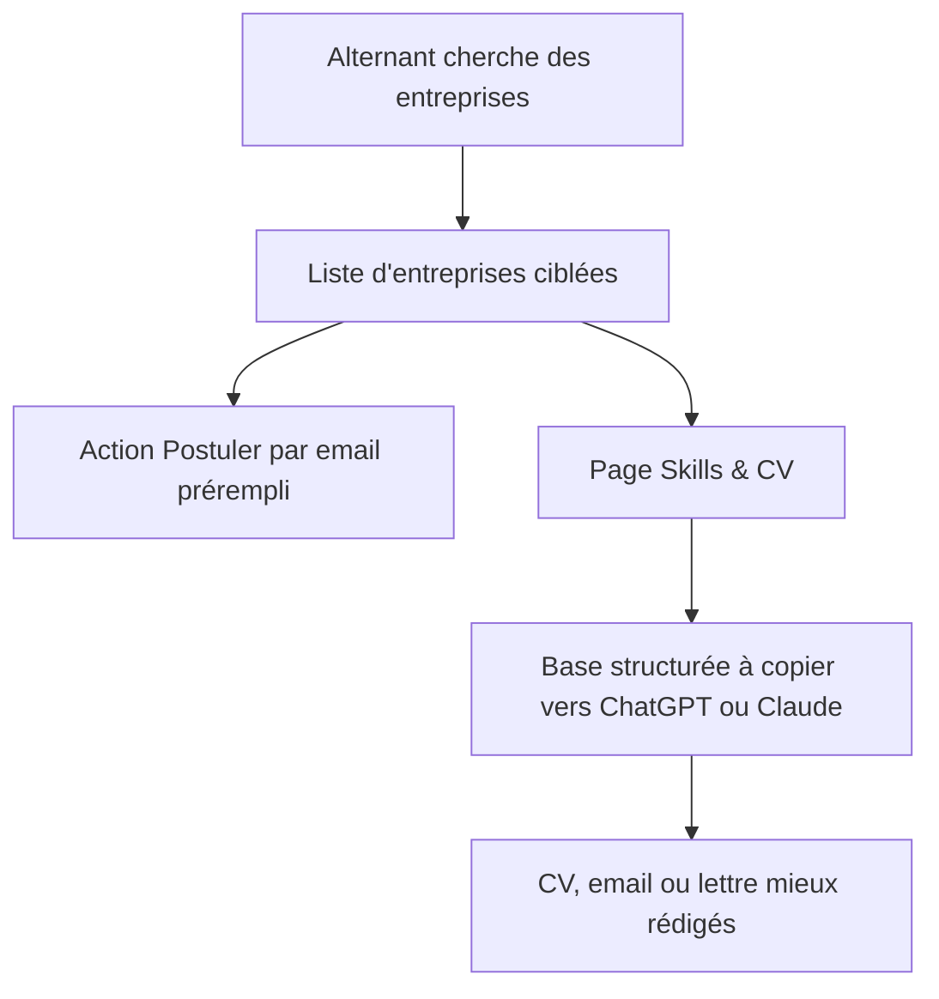
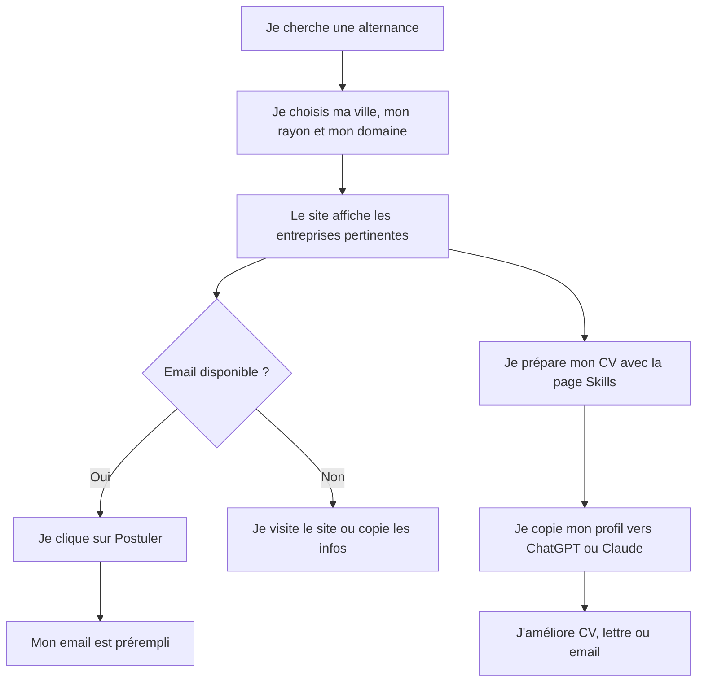

# Plan d’amélioration du site TrouveTaBoite

## Objectif produit

Faire évoluer TrouveTaBoite d’un outil de recherche d’entreprises vers un assistant simple pour aider les alternants à :

1. trouver des entreprises pertinentes autour d’eux ;
2. identifier celles qu’ils peuvent contacter ;
3. préparer une candidature propre rapidement ;
4. envoyer un email de candidature prérempli ;
5. copier une base de compétences structurée vers ChatGPT ou Claude pour améliorer CV, lettre ou email.

Le positionnement retenu est un **MVP sans compte candidat ni compte entreprise**, pour rester rapide à produire, peu risqué juridiquement et adapté à un site déjà en production.

---

## Diagnostic actuel

Le site possède déjà une bonne base technique :

- recherche d’entreprises par ville, code postal, rayon et secteur ;
- affichage des résultats avec informations officielles ;
- carte et distance ;
- filtres par type d’entreprise ;
- export CSV ;
- bouton de contact quand une adresse email est disponible ;
- backend sécurisé avec validation, limitation de requêtes et protections de base ;
- possibilité technique d’enrichir les données de contact via des services externes.

Limites actuelles pour l’usage alternance :

- le parcours n’est pas encore formulé autour de la candidature ;
- il n’existe pas de page dédiée aux compétences, CV ou préparation de candidature ;
- toutes les entreprises n’ont pas d’email public disponible ;
- le bouton de contact est générique, pas orienté “postuler en alternance” ;
- aucun suivi de candidatures n’existe pour l’instant ;
- pas de comptes utilisateurs, donc pas de stockage personnalisé durable côté serveur.

---

## Direction recommandée

Créer une expérience “Alternance” légère, composée de trois briques :

---

# 1. Ajouter un mode “Alternance”

## Ce que le système doit faire

Ajouter une entrée claire pour les alternants, par exemple :

- “Trouver une alternance”
- “Candidater aux entreprises”
- “Préparer ma candidature”

Ce mode doit reprendre la recherche existante, mais avec un vocabulaire plus orienté candidat :

- ville ou zone de recherche ;
- rayon ;
- domaine ou métier visé ;
- type d’entreprise ;
- entreprises avec contact disponible ;
- entreprises avec site web ;
- entreprises proches ;
- entreprises à prioriser.

## Valeur utilisateur

L’alternant ne vient plus seulement “chercher une entreprise”, il vient avec un objectif clair : **trouver où candidater**.

## Capacité technique

**Facile.**

La recherche existe déjà. Il s’agit surtout d’adapter le parcours, les textes, les boutons et certains filtres.

## Risques

Faibles.

Il faudra seulement éviter de promettre que toutes les entreprises recrutent en alternance. Le site peut dire :

> “Ces entreprises correspondent à ta zone et ton secteur. Vérifie leurs offres ou contacte-les pour une candidature spontanée.”

---

# 2. Transformer le bouton “Contacter” en “Postuler”

## Ce que le système doit faire

Quand une entreprise possède une adresse email, afficher un bouton plus utile :

- “Postuler”
- “Envoyer ma candidature”
- “Candidature alternance”

Au clic, le candidat doit pouvoir ouvrir son logiciel mail avec :

- destinataire prérempli ;
- objet prérempli ;
- message de candidature prérempli ;
- nom de l’entreprise automatiquement repris ;
- mention du type de contrat : alternance ;
- texte simple que l’utilisateur peut personnaliser.

Exemple de comportement attendu :

> L’utilisateur clique sur “Postuler”, son application email s’ouvre avec un message prêt à modifier et envoyer.

## Valeur utilisateur

Très forte pour un MVP : cela réduit la friction et donne un cadre aux alternants qui ne savent pas quoi écrire.

## Capacité technique

**Facile.**

Le site sait déjà ouvrir un email quand l’adresse existe. Il faut enrichir le contenu généré.

## Risques

Faibles, car le site ne stocke pas la candidature et n’envoie pas lui-même d’email.

## Points d’attention

Prévoir un message sobre pour éviter le spam :

- pas d’envoi automatique massif ;
- un email par entreprise ;
- l’utilisateur reste maître de l’envoi ;
- rappeler de personnaliser le message.

---

# 3. Gérer les entreprises sans email public

## Problème

Toutes les entreprises ne fournissent pas d’email public dans les sources gratuites.

## Ce que le système doit faire

Quand aucun email n’est disponible, proposer d’autres actions :

- visiter le site web si disponible ;
- chercher la page recrutement ;
- appeler l’entreprise si un téléphone est disponible ;
- copier le nom de l’entreprise ;
- copier une phrase de recherche à coller dans Google ;
- exporter l’entreprise dans une liste de prospection ;
- afficher “Email non disponible via les données publiques”.

## Valeur utilisateur

Cela évite que l’utilisateur soit bloqué quand l’email manque.

## Capacité technique

**Facile à moyenne.**

Les données principales existent déjà pour beaucoup de cas. Il faut surtout améliorer les actions proposées selon les informations disponibles.

## Risques

Faibles.

Attention à ne pas inciter à du scraping agressif ou à afficher des données non fiables.

---

# 4. Créer une page dédiée “Skills & CV”

## Décision validée

Créer une page dédiée avec un **mix bibliothèque + formulaire**.

L’objectif n’est pas d’intégrer directement une IA au départ, mais de fournir une base très propre que l’utilisateur pourra copier dans ChatGPT ou Claude.

## Ce que la page doit permettre

L’alternant doit pouvoir construire une fiche claire avec :

- métier ou domaine visé ;
- formation actuelle ;
- niveau d’étude ;
- rythme d’alternance ;
- date de début ;
- durée recherchée ;
- localisation ou mobilité ;
- compétences techniques ;
- compétences humaines ;
- outils maîtrisés ;
- projets réalisés ;
- expériences ;
- objectifs professionnels ;
- type d’entreprise souhaité.

## Bibliothèque de skills

La page doit proposer des compétences prêtes à sélectionner par domaine, par exemple :

- développement web ;
- marketing digital ;
- commerce ;
- communication ;
- design ;
- comptabilité ;
- ressources humaines ;
- gestion de projet ;
- cybersécurité ;
- data ;
- immobilier ;
- restauration / hôtellerie ;
- BTP ;
- santé / social.

Chaque domaine peut proposer :

- compétences techniques ;
- outils ;
- qualités utiles ;
- exemples de missions ;
- mots-clés à mettre dans un CV ;
- formulations adaptées à un profil junior.

## Formulaire personnalisé

L’utilisateur doit compléter ses propres informations pour éviter un résultat trop générique.

Le système doit ensuite produire un bloc structuré à copier.

## Résultat attendu

La page doit générer une sortie du type :

- résumé du profil ;
- liste de compétences ;
- expériences ou projets ;
- objectif d’alternance ;
- contraintes pratiques ;
- prompt prêt à copier dans ChatGPT ou Claude.

## Exemple de sortie fonctionnelle

Le site pourrait proposer :

> “Copie ce bloc dans ChatGPT ou Claude pour générer ton CV, ton email de candidature ou ta lettre de motivation.”

Puis fournir une base structurée avec les informations de l’utilisateur.

## Capacité technique

**Moyenne.**

Pas besoin d’IA intégrée ni de base de données au départ, mais il faut concevoir une bonne expérience utilisateur avec :

- formulaire guidé ;
- bibliothèque sélectionnable ;
- génération de texte ;
- bouton copier ;
- contenu adapté aux alternants.

## Risques

Faibles.

Données personnelles limitées si rien n’est stocké côté serveur. Il faut afficher clairement que l’utilisateur ne doit pas entrer d’informations trop sensibles s’il compte les copier dans un outil tiers.

---

# 5. Ajouter des modèles de prompts pour ChatGPT et Claude

## Ce que le système doit faire

Sur la page Skills & CV, proposer plusieurs prompts prêts à copier :

1. “Améliore mon CV pour une alternance”
2. “Rédige un email de candidature spontanée”
3. “Rédige une lettre de motivation courte”
4. “Adapte mon profil à cette entreprise”
5. “Trouve les compétences à mettre en avant”
6. “Corrige et rends mon message plus professionnel”

## Valeur utilisateur

Très forte.

Cela permet aux alternants d’utiliser l’IA sans que le site ait à payer une API ou gérer des données sensibles.

## Capacité technique

**Facile.**

C’est principalement du contenu structuré et des boutons de copie.

## Risques

Faibles.

Ajouter une mention claire :

> “Ne partage pas d’informations sensibles avec un outil externe si tu ne veux pas qu’elles soient traitées par ce service.”

---

# 6. Ajouter un mini assistant de candidature sans compte

## Ce que le système doit faire

Permettre à l’utilisateur de constituer une petite liste d’entreprises à contacter pendant sa session.

Fonctions possibles :

- ajouter une entreprise à “ma sélection” ;
- marquer comme “à contacter” ;
- marquer comme “contactée” ;
- copier la liste ;
- exporter la liste ;
- voir quelles entreprises ont un email ;
- voir quelles entreprises ont seulement un site web.

## Valeur utilisateur

Cela aide l’alternant à organiser ses candidatures sans créer de compte.

## Capacité technique

**Moyenne.**

Possible sans compte serveur au départ, avec une sauvegarde locale dans le navigateur.

## Risques

Faibles si aucune donnée sensible n’est envoyée au backend.

## Limite

Si l’utilisateur change d’appareil ou vide son navigateur, la liste peut disparaître. Pour le MVP, c’est acceptable.

---

# 7. Ajouter un score de priorité des entreprises

## Ce que le système doit faire

Aider l’alternant à savoir par où commencer.

Chaque entreprise pourrait être mise en avant selon des critères simples :

- proche de la localisation ;
- dans le bon secteur ;
- email disponible ;
- site web disponible ;
- taille potentiellement adaptée ;
- entreprise active ;
- informations complètes.

## Exemple de labels

- “À contacter en priorité”
- “Contact facile”
- “Site web disponible”
- “Email non disponible”
- “Proche de toi”
- “Grande structure”
- “Petite structure”

## Valeur utilisateur

Très forte pour éviter une liste brute difficile à exploiter.

## Capacité technique

**Moyenne.**

Les données nécessaires sont en partie déjà disponibles. Il faut définir des règles simples et compréhensibles.

## Risques

Modérés.

Il faut éviter de laisser croire que le site sait si l’entreprise recrute vraiment. Le score doit être présenté comme une aide à la priorisation, pas comme une garantie.

---

# 8. Ajouter des filtres utiles pour les alternants

## Filtres recommandés

Ajouter ou mettre en avant :

- entreprises avec email ;
- entreprises avec site web ;
- entreprises proches ;
- entreprises avec téléphone ;
- taille d’entreprise si disponible ;
- type d’entreprise ;
- secteur ;
- distance ;
- entreprises actives uniquement.

## Valeur utilisateur

Très forte.

Un alternant cherche souvent à contacter vite des entreprises réellement joignables.

## Capacité technique

**Facile à moyenne.**

Certains filtres existent déjà ou peuvent être déduits des données actuelles.

## Risques

Faibles.

---

# 9. Créer une page d’aide “Comment trouver son alternance”

## Ce que le système doit contenir

Une page éditoriale courte, utile pour le SEO et pour l’utilisateur :

- comment choisir ses entreprises ;
- comment candidater sans offre publiée ;
- comment écrire un email court ;
- comment relancer ;
- combien d’entreprises contacter par semaine ;
- comment adapter son CV ;
- comment utiliser ChatGPT ou Claude intelligemment ;
- erreurs fréquentes des alternants ;
- exemple d’objet d’email ;
- exemple de message de relance.

## Valeur utilisateur

Bonne valeur immédiate et potentiel SEO.

## Capacité technique

**Facile.**

Principalement du contenu.

## Risques

Très faibles.

---

# 10. Ne pas intégrer l’IA directement au départ

## Recommandation

Pour le MVP, ne pas intégrer directement ChatGPT ou Claude dans le site.

## Pourquoi

L’intégration IA apporterait :

- coût API ;
- gestion de quotas ;
- consentement utilisateur ;
- politique de confidentialité plus stricte ;
- traitement de données personnelles ;
- risques de réponses imprécises ;
- complexité produit supplémentaire.

## Alternative retenue

Créer une très bonne page Skills & CV avec :

- bibliothèque de compétences ;
- formulaire guidé ;
- prompts prêts à copier ;
- bouton copier ;
- conseils d’utilisation.

## Capacité technique

**Facile à moyenne**, beaucoup plus raisonnable qu’une IA intégrée.

---

# 11. Évolutions futures possibles

## Phase 2 : comptes candidats

À envisager seulement si le MVP montre de l’usage.

Fonctions possibles :

- sauvegarder son profil ;
- sauvegarder ses skills ;
- suivre ses candidatures ;
- ajouter des relances ;
- importer ou générer plusieurs versions de CV ;
- historique des entreprises contactées.

Capacité technique : **élevée**.

Raisons :

- authentification ;
- données personnelles ;
- sécurité ;
- RGPD ;
- stockage durable ;
- suppression de compte ;
- confidentialité.

---

## Phase 3 : espace entreprise

À envisager plus tard.

Fonctions possibles :

- entreprise qui revendique sa fiche ;
- publication d’offres d’alternance ;
- réception de candidatures ;
- tableau de bord recruteur ;
- messagerie ;
- modération.

Capacité technique : **élevée à très élevée**.

Raisons :

- double marché candidat / recruteur ;
- modération ;
- anti-spam ;
- conformité ;
- support ;
- vérification des entreprises ;
- gestion des candidatures.

---

## Phase 4 : candidature directement depuis le site

À ne pas faire en premier.

Fonctions possibles :

- formulaire de candidature ;
- dépôt de CV ;
- envoi automatique à l’entreprise ;
- suivi ;
- notifications.

Capacité technique : **élevée**.

Raisons :

- stockage de fichiers ;
- données personnelles sensibles ;
- délivrabilité email ;
- consentement ;
- sécurité ;
- anti-abus ;
- responsabilité plus forte du site.

---

# Priorisation recommandée

## Priorité 1 — MVP rapide

1. Ajouter un mode ou une section “Alternance”.
2. Renommer et adapter les actions de contact en “Postuler”.
3. Générer un email de candidature prérempli.
4. Ajouter des actions alternatives quand l’email manque.
5. Créer la page “Skills & CV” avec bibliothèque + formulaire.
6. Ajouter les prompts prêts à copier vers ChatGPT ou Claude.

Capacité technique globale : **facile à moyenne**.  
Impact utilisateur : **élevé**.  
Risque : **faible**.

---

## Priorité 2 — Organisation des candidatures

1. Ajouter une sélection d’entreprises.
2. Ajouter des statuts simples : à contacter, contactée, à relancer.
3. Ajouter un export orienté candidatures.
4. Ajouter des filtres “contact disponible”.
5. Ajouter un score de priorité.

Capacité technique globale : **moyenne**.  
Impact utilisateur : **élevé**.  
Risque : **faible à modéré**.

---

## Priorité 3 — Croissance et SEO

1. Page “Comment trouver son alternance”.
2. Modèles d’emails.
3. Guides par secteur.
4. Pages conseils pour alternants.
5. Amélioration du wording de la page d’accueil.

Capacité technique globale : **facile**.  
Impact SEO : **bon**.  
Risque : **très faible**.

---

# Plan final conseillé

## Version 1 améliorée

Le site devient :

> “Trouve les entreprises autour de toi et prépare ta candidature d’alternance en quelques minutes.”

Le parcours idéal :

---

# Conclusion

Ton idée est très bonne parce qu’elle correspond exactement à ce que le projet peut faire rapidement sans devenir trop complexe.

La meilleure amélioration est de ne pas créer tout de suite une grosse plateforme de recrutement, mais plutôt un **assistant de candidature pour alternants** :

- recherche d’entreprises ;
- email prérempli ;
- page skills ;
- prompts pour ChatGPT ou Claude ;
- sélection d’entreprises ;
- aide à la priorisation.

C’est techniquement réaliste, utile immédiatement, compatible avec la production actuelle, et ça permet de tester le marché avant de développer des comptes candidats ou entreprises.
